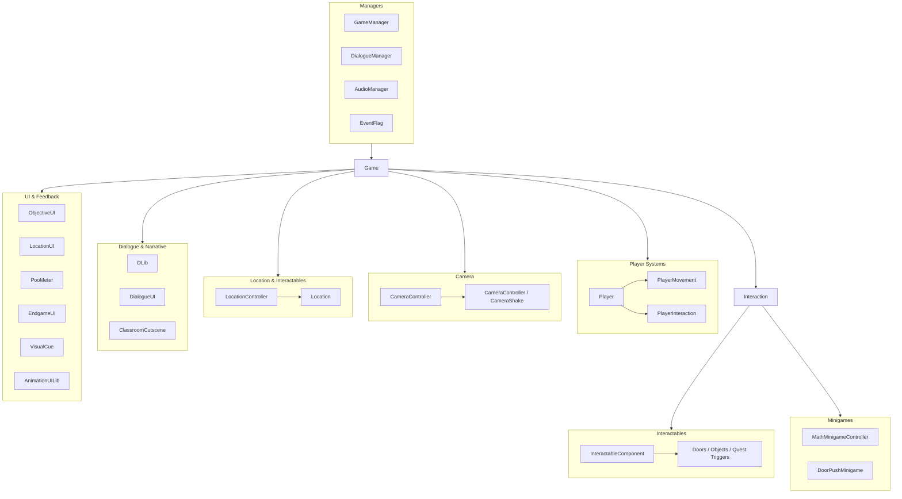
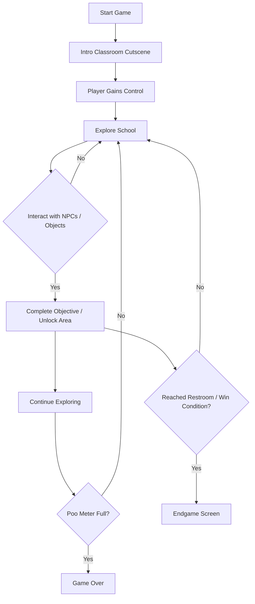

<h1 align="center">⌛ Butt Pressure 💩</h1>

<p align="justify">A time-pressured puzzle game where you have to find a toilet before the time runs out. The player takes on the role of a new student who suddenly needs to find a restroom as fast as possible while navigating classrooms, hallways, doors, and interactive NPCs. The core tension comes from a rising “poo meter,” which pushes the player to keep moving while also forcing them to manage timing, exploration, and objective completion.</p>

## Overview 🌐
<p align="justify">The main logic is contained in the `Assets/Resources/1. C#` folder, where gameplay systems, interactions, UI, minigames, and narrative scripts are separated by responsibility.</p>

```text
ButtPressure/
└── Assets/
    └── Resources/
        └── 1. C#/
            ├── Audio/
            ├── Camera/
            ├── Common/
            ├── Cutscene/
            ├── Interactable/
            ├── Location/
            ├── Minigame/
            ├── Player/
            ├── Settings/
            └── UI/
```

- `Assets/Resources/` is used for project assets and scripts that are referenced by the game scene.
- `Assets/Resources/1. C#/` contains the custom C# codebase, organized into folders such as `Player`, `Interactable`, `UI`, `Common`, `Location`, `Minigame`, `Audio`, `Camera`, and `Cutscene`.

## Key Features ✨
- 2D movement and interaction-driven exploration across multiple school areas
- Dialogue-heavy narrative and cutscene-based introduction
- Dynamic objective system to guide the player through the level
- Urgency mechanic via the poo meter, which creates the game’s fail condition
- Multiple interactive objects including doors, stalls, janitor gameplay, and environment blockers
- NPC and quest progression with scripted interactions and event-driven state changes
- UI overlays for objective tracking, location names, and endgame screens
- Audio, camera, and animation feedback to reinforce game states and pacing

## Main Modules and Components 🧩



| Category | Module / Component | Purpose |
| --- | --- | --- |
| Managers | `GameManager` | Central controller for game flow, initialization, UI scenes, and win/lose condition handling. |
| Managers | `DialogueManager` | Typing-based dialogue system, skip logic, UI management, and character text flow. |
| Managers | `AudioManager` | Handles runtime music and sound effects for the game. |
| Managers | `EventFlag` | Central store for quest flags, story state, and event-driven progression. |
| Player Systems | `Player` | Singleton that manages player state, input enable/disable, and movement delegation. |
| Player Systems | `PlayerMovement` | Handles horizontal movement, forced movement, walking animation, and sound triggers. |
| Player Systems | `PlayerInteraction` | Detects nearby interactables and processes `E` interaction input. |
| Camera / Settings | `CameraController`, `CameraShake` | Handles camera follow, framing, shake, and cinematic feedback during gameplay. |
| Camera / Settings | `AudioSettingsController`, `DisplaySettingsController` | Manages audio and display configuration in the game settings. |
| Location & Interactables | `Location` | Holds location metadata and exposes location behavior to the game. |
| Location & Interactables | `LocationController` | Switches active school areas and updates the location label seen by the player. |
| Location & Interactables | `InteractableComponent` | Connects triggered colliders to the actual interactable logic using `IInteractable`. |
| Location & Interactables | `Door`, `DoorPush`, `Locker`, `NormalToilet`, `BullyBlockade`, `CrowdBlockade`, `BullyQuest`, `JanitorQuest`, etc. | Environmental objects and NPC-driven triggers that gate progression, unlock paths, and drive quests. |
| Minigames & Cutscenes | `MathMinigameController`, `DoorPushMinigame` | Main logic for the game’s puzzle and challenge interactions. |
| Minigames & Cutscenes | `ClassroomCutscene` | Intro narrative sequence that establishes the story and initial objective. |
| Dialogue & Narrative | `DLib` | Character metadata, names, and dialogue color definitions used in story scenes. |
| Dialogue & Narrative | `DialogueUI` | Visual presentation layer for dialogue boxes and text elements. |
| UI & Feedback | `ObjectiveUI` | Displays the active Objective for the player to complete. |
| UI & Feedback | `LocationUI` | Shows the player the current room or location. |
| UI & Feedback | `PooMeter` | Tracks the pressure meter and triggers the fail condition. |
| UI & Feedback | `EndgameUI` | Displays victory or defeat screens after the game ends. |
| UI & Feedback | `VisualCue` | Shows nearby prompt hints and interaction cues. |
| UI & Feedback | `AnimationUILib` | Handles UI animation transitions and movement feedback. |

## Gameplay Flow 🎮



1. <p align="justify">The game begins with a classroom introduction cutscene, where the player is introduced to the story and learns the basic goal: find the restroom.</p>
2. <p align="justify">The player gains control after the opening sequence and starts exploring the school using standard movement and interaction input.</p>
3. <p align="justify">The objective UI updates as new goals appear, pushing the player to progress through different spaces and interact with environment triggers.</p>
4. <p align="justify">As the player moves through the school, they encounter doors, NPCs, and quest-driven interactions that may unlock paths or reveal additional story beats.</p>
5. <p align="justify">The poo meter continues rising over time, creating constant urgency and a lose condition if the player does not reach a successful resolution quickly enough.</p>
6. <p align="justify">The player must keep exploring, completing required interactions, and managing movement efficiently until they reach the intended toilet/restroom objective or trigger the end state.</p>
7. <p align="justify">The game ends in either failure (poo meter maxed out) or success (objective progression resolves the end condition), with the result shown through the endgame UI.</p>

## Additional Info 📝

<ul align="justify">
<li><strong>Made by:</strong><br>Maximillian Kenas<br>Natanael Kevin Kurniawan<br>Dave Franklin Lewandi<br>Delvin Susilo</li>
</ul>

<br>

| Contributions by **Maximillian Kenas** |
| --- |
| Designed and arranged the environment layout and level composition |
| Identified and fixed gameplay bugs and technical issues |
| Built and refined the main menu UI |
| Did a major post-jam refactor to improve structure and maintainability |

<br>

| Contributions by **Natanael Kevin Kurniawan** |
| --- |
| Developed core game mechanics and system logic |
| Developed the gameplay flow and sequence structure |
| Created and refined the in-game UI |
| Worked on polishing, visual finishing, and lighting improvements |

<br>

| Contributions by **Dave Franklin Lewandi** |
| --- |
| Created the 2D character and 3D environment assets used across the project |

<br>

| Contributions by **Delvin Susilo** |
| --- |
| Design and shape the overall game design and direction |
| Sourced supporting assets such as audio and fonts |


<br>

This game was submitted to BGDJam 2026.<br>
Game page: <a href="https://dupow.itch.io/butt-pressure">itch.io</a>
